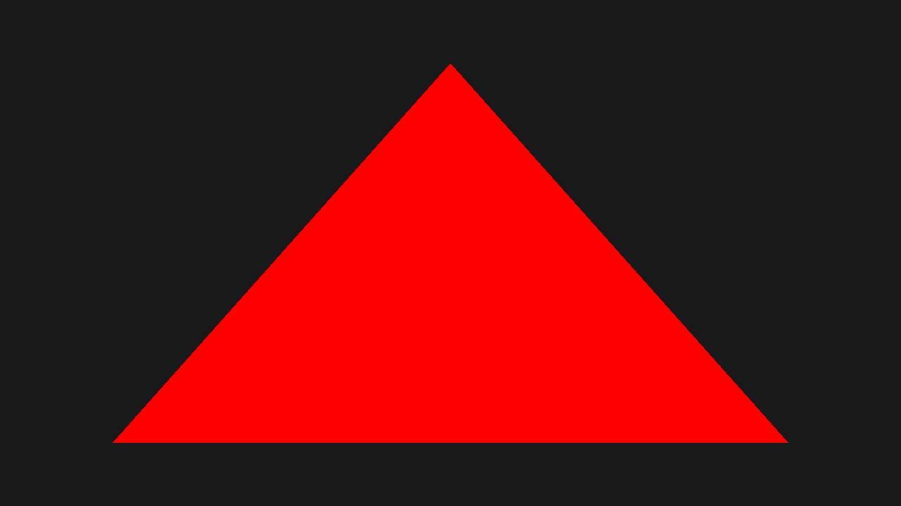
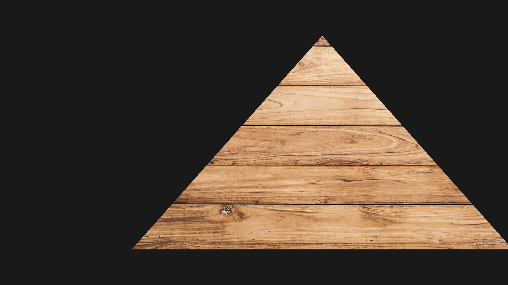
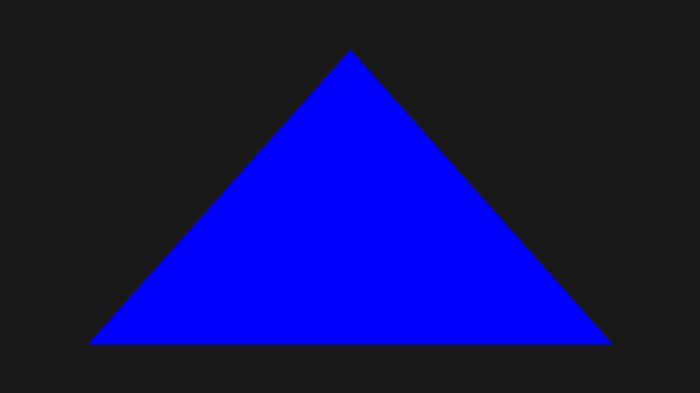
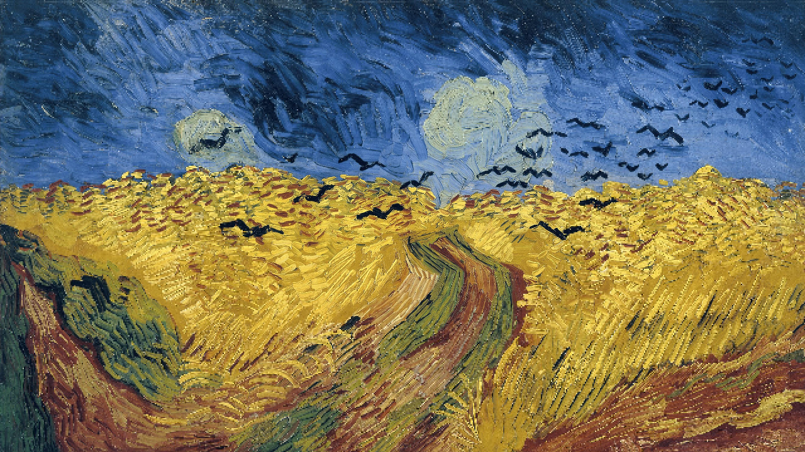

# Wolf-Engine 2.0

A modular, high-performance C++ engine framework designed for Vulkan-based rendering. Wolf-Engine focuses on a clean separation between low-level hardware abstraction and high-level engine systems to ensure extensibility and multi-platform performance.

**Supported platforms:** Windows, Linux (NixOS), Android \
**Graphics API:** Vulkan (architected for multi-API support)

---

## Architecture and modules

The project is divided into three core modules:

### 1. GraphicAPIBroker (RHI)
This is the **Rendering Hardware Interface (RHI)**. It serves as the abstraction layer between the engine and the graphics driver. 
* **API Independence:** While currently focused on Vulkan, the "Broker" architecture is designed so that additional APIs (like DX12 or Metal) can be integrated with minimal impact on the rest of the engine.

### 2. Wolf-Engine-2.0 (Core system)
The main engine framework that orchestrates high-level logic and resource flow:
* **Command orchestration:** Manages automated command buffer recording and submission.
* **Task scheduler:** A multi-threaded job system for parallelizing engine updates.
* **UI system:** Integrated **UltraLight** support for HTML/CSS/JS-based user interfaces.
* **Input and windowing:** Cross-platform abstraction for user input and window management.

### 3. Common
A foundational utility library containing shared helpers, resource tracking, and logging systems used across the entire stack.

---

## Installation and setup

### Prerequisites
- **Vulkan SDK:** 1.4.321.1 or higher.
- **Compiler:** C++17/20 compliant compiler (MSVC, Clang, or GCC).

### Build Instructions
1. Clone the project:
   ```bash
   git clone https://github.com/arthur-monteiro/WolfEngine-2.0
2. Build using CMake.

--- 

## Mnimal examples

The following projects serve as both minimal implementation references and **automated graphic integration tests** to ensure API stability across updates:

### HelloTriangle
Standard graphics pipeline validation including vertex/fragment shader stages and swapchain presentation.
<p align="center">
  
</p>

### ComputePass
GPGPU workflow validation, testing compute shader dispatch.
<p align="center">
  
</p>

### DescriptorSet
Validation of shader resource binding, and descriptor pool management.
<p align="center">
  
</p>

### HelloRayTracing
Validation of the hardware-accelerated ray tracing pipeline (`VK_KHR_ray_tracing`) including BLAS/TLAS building and ray-gen shaders.
<p align="center">
  
</p>

### VariableRateShading
Validation of the `VK_KHR_fragment_shading_rate` extension. This test demonstrates the ability to dynamically adjust the shading rate across the frame to optimize fragment shader performance in areas with low visual detail.
<p align="center">
  
</p>